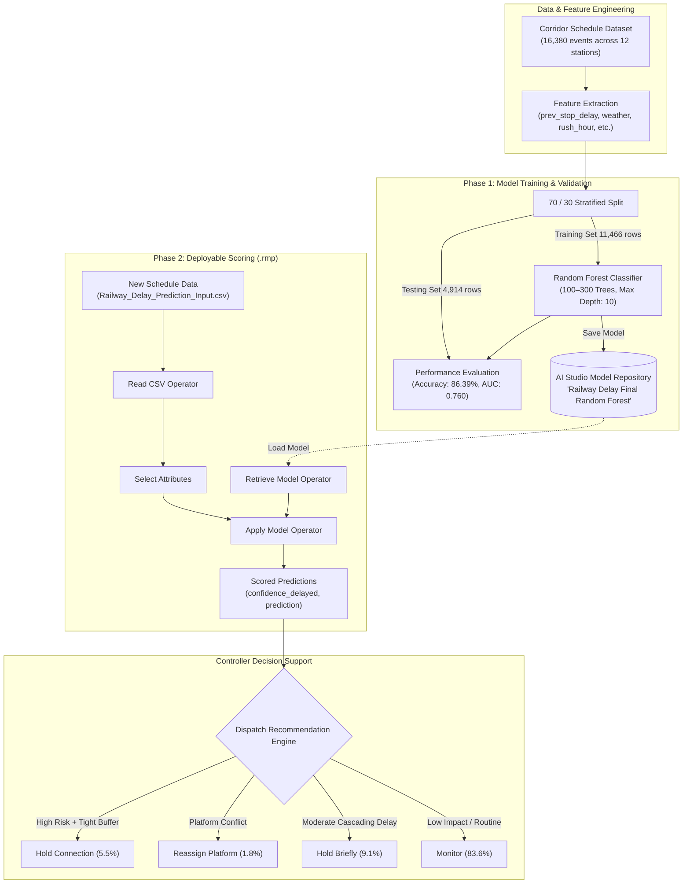

# 🚆 Predictive Railway Delay & Rescheduling System

> **AI Studio–Based Cascading Delay Prediction and Dispatch Recommendation for a Rail Corridor Network**  
> *Final Project for the Siemens Industry Readiness Program (SIRP)*  
> **Author:** Aravind (Easwari Engineering College)

[](https://altair.com/)
[]()
[]()
[]()
[](LICENSE)

---

## 📌 Executive Summary

Railway corridors accumulate delays dynamically through shared platforms, common tracks, and tight passenger transfer windows. A minor delay in a single inbound service frequently ripples across connecting trains, creating widespread cascading schedule disruptions.

This project implements an end-to-end predictive machine learning pipeline using **Altair AI Studio** to screen scheduled train movements along an active rail corridor and forecast the probability of delay at subsequent station stops. Designed as a modular **two-process architecture**:
1. **Model Training & Evaluation Phase:** Trains an ensemble **Random Forest** classifier on a comprehensive engineered dataset of corridor operations (16,380 events) using a 70/30 stratified train-test split.
2. **Deployable Scoring Process (`.rmp`):** A production-ready Altair AI Studio workflow (`Railway Delay Prediction and Analysis System.rmp`) that ingests new schedule inputs, retrieves the pre-trained model from the repository, and outputs delay probabilities in real time to assist railway traffic controllers.

---

## 🏗️ System Architecture



---

## 📊 Dataset & Feature Dictionary

The study models a 12-station rail corridor spanning 274 km with 28 daily train services across 4 operational classes (**Express**, **Passenger**, **Suburban**, **Freight**) over 90 simulated operating days (16,380 train-stop records and 79 defined train-to-train junction connections).

| Feature Name | Type | Description |
| :--- | :--- | :--- |
| `station_id` | Categorical | Station identifier (`S01` to `S12`, e.g., Central Jn, Junction East, Terminal South) |
| `km_from_origin` | Numeric | Distance in kilometers from corridor origin station |
| `num_platforms` | Numeric | Platform capacity of the station (platform contention proxy) |
| `train_type` | Categorical | Operational train classification (`Express`, `Passenger`, `Suburban`, `Freight`) |
| `sched_hour` | Numeric | Scheduled arrival hour (0–23) |
| `day_of_week` | Categorical | Day of operation (`Monday` – `Sunday`) |
| `is_rush_hour` | Binary | Peak congestion indicator (07:00–10:00 and 17:00–20:00) |
| `is_weekend` | Binary | Weekend service schedule indicator |
| `weather` | Categorical | Environmental conditions (`Clear`, `Rain`, `Fog`, `Storm`) |
| `stop_sequence` | Numeric | Sequential stop index along the train's route |
| `prev_stop_delay` | Numeric | Observed delay in minutes at the preceding station stop |
| `is_origin` | Binary | Flag indicating the first station stop of the service |
| `is_destination` | Binary | Flag indicating terminal destination stop |
| **`label_delayed`** | Binary (Target) | Classification label: `1` if arrival delay ≥ 5 minutes, else `0` |

---

## 📈 Model Performance & Evaluation

Evaluated on the held-out **4,914-row test set** (30% split) in Altair AI Studio:

| Evaluation Metric | Test Result | Interpretation |
| :--- | :---: | :--- |
| **Overall Accuracy** | **86.39%** | Correctly predicts overall stop arrival punctuality |
| **ROC-AUC** | **0.760** | Strong discrimination ability between on-time and delayed stops |
| **Precision (Delayed Class)** | **56.71%** | 56.7% of delay alerts are true delays (minimizes false alarms) |
| **Recall (Delayed Class)** | **42.61%** | Successfully catches 42.6% of delay incidents before arrival |
| **F1-Score (Delayed Class)** | **48.66%** | Harmonic balance between precision and recall |
| **Class Recall (On-Time Class)**| **94.20%** | Exceptional reliability at verifying on-schedule services |

### Key Operational Insights:
- **Primary Delay Driver:** `prev_stop_delay` accounted for **52.3%** of total predictive importance—confirming that propagation of upstream delays is the single largest factor in next-stop punctuality.
- **Service Disparity:** Freight operations experience delay rates approximately **4× higher** than priority passenger Express services.
- **Weather Sensitivity:** Severe weather events (storms, dense fog) approximately **double** corridor-wide delay frequencies.
- **Cascading Growth:** Average delay steadily increases with `stop_sequence` rather than resetting between stations.

---

## 📁 Repository Structure

```text
├── Railway Delay Prediction and Analysis System.rmp   # Production Altair AI Studio scoring workflow
├── Railway_Delay_Dataset.csv                          # Full engineered dataset (16,380 records)
├── Railway_Delay_Prediction_Input.csv                 # Sample operational input for real-time scoring
├── stations.csv                                       # Station network topology & platform layout
├── connections.csv                                    # Train-to-train junction connection mappings
├── Railway_Delay_Project_Deck.pdf                     # Final project presentation slide deck
├── Railway_Delay_Project_Report.docx                  # Full technical project report & documentation
├── .gitignore                                         # Git ignore rules for non-project files
├── LICENSE                                            # MIT Open Source License
└── README.md                                          # Project overview and technical documentation
```

---

## 🚀 How to Run the Pipeline

### Prerequisites
- **Altair AI Studio** (version 12.0 or newer)
- Trained model saved into your AI Studio Repository under the alias `Railway Delay Final Random Forest` (or follow Phase 1 training instructions in Section 10 of the project report).

### Steps to Run:
1. **Clone this repository:**
   ```bash
   git clone https://github.com/aravindm30112006/Railway-Delay-Prediction-System.git
   cd Railway-Delay-Prediction-System
   ```
2. **Open Altair AI Studio:**
   - Launch Altair AI Studio and choose **File > Open Process...**
   - Select `Railway Delay Prediction and Analysis System.rmp`.
3. **Configure the Input Source:**
   - Click on the `Read CSV` operator.
   - Set the `csv_file` parameter path to the local path of `Railway_Delay_Prediction_Input.csv`.
4. **Verify Model Retrieval:**
   - Select the `Retrieve` operator and ensure the `repository_entry` points to your trained Random Forest model.
5. **Execute Workflow:**
   - Press **Run (F11)**.
   - Inspect the results view for generated prediction columns: `prediction(label_delayed)`, `confidence(0)`, and `confidence(1)`.

---

## 📄 License & Attribution

This project is licensed under the [MIT License](LICENSE).  
Developed as part of the **Siemens Industry Readiness Program (SIRP)**.
